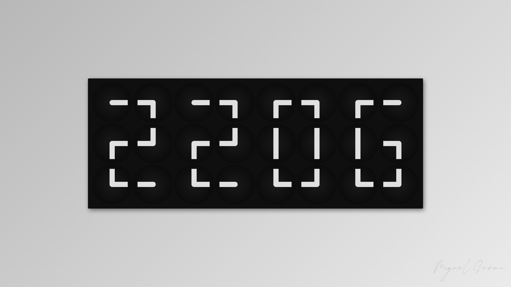

# ClockClock24

### [⬇ Download — ClockClock24 v2.2 Installer (.pkg)](https://github.com/llagmanty/Mac-Screen-saver-ClockClock24/raw/main/ClockClock24-2.2-Installer.pkg)

> macOS 13 or later · No admin password required · Installs in seconds
> Signed & notarized by Apple — opens without any Gatekeeper warning

---



---

A macOS screen saver inspired by the *ClockClock 24* kinetic sculpture by [Humans Since 1982](https://www.humanssince1982.com). Twenty-four analog clocks arranged in a 3 × 8 grid rotate their hands to display the current time in **HH:MM**, then break into continuous choreographed motion between updates.

<div align="center">
  <a href="https://www.buymeacoffee.com/llagmanty">
    
  </a>
</div>

---

## Preview

> The screensaver runs a strict 60-second cycle with zero idle time:
> **20 s** time display → **40 s** kinetic choreography → repeat.

| Phase | What you see |
|---|---|
| Time Display | All 24 clocks transition to the current HH:MM and hold for legibility |
| Choreography | Four randomised kinetic patterns play in sequence — sweep wave, pinwheel, radial pulse, diagonal cascade |

---

## Features

- **60-second animated cycle** — alternates between time display and choreography with no idle frames
- **Four kinetic patterns** — randomised order each cycle; sweep wave, pinwheel, radial pulse, diagonal cascade
- **Unified L-shape hands** — each clock's two hands are drawn as a single continuous stroke with a smooth filleted corner at the pivot and flat outer tips; no visible joint or pin
- **Minimal clock face** — centered soft radial gradient, no border ring, no glass overlay
- **Full-bar choreography** — during kinetic sequences both hands span edge-to-edge, forming a rotating line across the full face of each clock
- **Author signature** — rendered directly from SVG path data in the bottom-right corner of the background

---

## Requirements

| | |
|---|---|
| **macOS** | 13 Ventura or later |
| **Architecture** | Apple Silicon and Intel (universal binary) |

---

## Installation

### Option A — Installer (recommended)

1. Download `ClockClock24-2.1-Installer.pkg` from this repository
2. Double-click to run the installer — no admin password required
3. Open **System Settings → Screen Saver** and select **ClockClock24**

The installer places `ClockClock24.saver` in `~/Library/Screen Savers/` for the current user only. Running a newer installer automatically replaces any previous version.

### Option B — Manual

1. Build the project in Xcode (`ClockClock24.xcodeproj`, Release configuration)
2. Copy the built `ClockClock24.saver` to `~/Library/Screen Savers/`
3. Select it in **System Settings → Screen Saver**

### Uninstall

Delete `~/Library/Screen Savers/ClockClock24.saver` and choose a different screen saver in System Settings.

---

## How It Works

The project is a single Swift file ([ClockClock24View.swift](ClockClock24View.swift)) with three layers:

**`ClockClock24View`** (`ScreenSaverView`) owns the 3 × 8 grid of `ClockView` subviews, drives the 60-second cycle state machine, and dispatches choreography patterns at 60 fps.

**`ClockView`** (`NSView`) draws one clock face. It supports two modes:
- `animateTo(_:duration:)` + `tick()` — eased clockwise-only rotation toward a target angle (used during time display)
- `drive(_:)` — direct angle set each frame (used during choreography)

**Hand rendering** — both hands are drawn as a single `NSBezierPath` polyline (`tipH → pivot → tipM`) stroked with `.lineCapStyle = .butt` (flat tips) and `.lineJoinStyle = .round` (smooth fillet at the pivot).

**Digit shapes** — each digit (0–9) is encoded as a 3 × 2 grid of `ClockConfig` values, each specifying target angles for the two hands of one clock. The four-digit layout maps to the 24 clocks as `digit[d] / row[r] / col[c] → grid[r][d * 2 + c]`.

---

## Changelog

### v2.2
- **Smooth choreography** — one pattern runs the full 40-second kinetic phase per cycle; no more mid-choreography hard cuts that caused visible jumps
- **Seamless entry** — per-clock angle offsets computed at the time-display → choreography boundary so hands flow directly into motion with zero jump

### v2.1
- **Flat hand tips** — outer ends of each hand are now a perpendicular flat cut (`.butt` cap) rather than a rounded pill, giving a sharper, more architectural finish while keeping the smooth filleted corner at the pivot
- **Author signature** — SVG path data for the signature is parsed at launch into a static `NSBezierPath` and rendered at 60 fps in the bottom-right corner of the wall background; no external assets

### v2.0
- **60-second animated cycle** — replaces the previous minute-timer approach; 20 s time display + 40 s choreography, zero idle time
- **Four kinetic choreography patterns** — sweep wave, pinwheel, radial pulse, diagonal cascade; randomised order every cycle
- **Redesigned clock hands** — single continuous L-shape stroke with smooth filleted inner corner; no separate pivot dot or junction disc
- **Flat clock face** — replaced the flat fill + bezel ring with a centered soft radial gradient and no border
- **Full-bar choreography** — both hands set 180° apart during kinetic sequences so each clock shows a complete rotating bar spanning edge-to-edge

### v1.0
- Initial release — 24 analog clocks in a 3 × 8 grid display HH:MM with clockwise ease-in-out hand animations; gray gradient wall, dark panel, per-minute update via `Foundation.Timer`

---

## Project Structure

```
ClockClock24View.swift   — entire screensaver: types, digit shapes, patterns, rendering
Info.plist               — bundle metadata and version
ClockClock24.xcodeproj   — Xcode project
ClockClock24.saver       — pre-built bundle (tracked for reference)
installer/               — productbuild distribution XML and HTML installer screens
ClockClock24-2.1-Installer.pkg  — ready-to-run installer
```

---

## Inspiration

*ClockClock 24* by [Humans Since 1982](https://www.humanssince1982.com) — a kinetic sculpture in which 24 analog clock mechanisms collaborate to display time, animating between digit configurations through choreographed rotations.

---

*Made by Miguel Serna*
